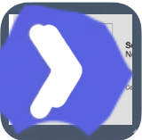

# Watch

**Time Tracking for Frappe Framework**

[](https://github.com/tonic-6101/watch/releases)
[](https://frappeframework.com)
[](LICENSE)

<p align="center">
  
</p>

Watch is a modern, standalone time tracking app built on the [Frappe Framework](https://frappeframework.com). Designed for teams and individuals who need clean, distraction-free time tracking without leaving their Frappe ecosystem, Watch offers a one-click timer, flexible tagging, and clear daily and weekly views.

---

## Features

### One-Click Timer

Start tracking time instantly with a single click or keyboard shortcut. Pause, resume, and stop without friction.

- Start/pause/stop from the top bar or keyboard shortcuts
- Active timer banner shows elapsed time across all pages
- Focus widget for distraction-free time tracking
- Timer state persists across page reloads

### Time Entries

Record where your time goes with structured entries that capture everything you need for reporting and billing.

- Date, start/end time, and automatic duration calculation
- Free-text descriptions for context
- Billable flag for client work
- Manual entry bar for adding past entries quickly

### Tag System

Organize entries with reusable tags for clients, projects, categories, or anything else that helps you slice your time data.

- Create and manage reusable tags
- Apply multiple tags per entry
- Filter views by tag
- Color-coded labels for quick visual scanning

### Daily View

See exactly how your day is going with a focused view of today's entries, total hours, and active timer.

- Chronological entry list for the selected day
- Running total of tracked time
- Quick-edit entries inline
- Navigate between days

### Weekly View

Step back and see the bigger picture with weekly summaries, bar charts, and donut breakdowns.

- Weekly bar chart showing daily totals
- Donut chart breaking down time by tag
- Week-over-week navigation
- Summary statistics

### Daily Nudges

Gentle reminders help you build consistent tracking habits without being intrusive.

- Daily nudge banner when no time has been tracked
- Idle detection banner after periods of inactivity
- Configurable nudge preferences

### Keyboard Shortcuts

Power users can drive Watch entirely from the keyboard.

- Shortcuts overlay showing all available bindings
- Start/stop timer without reaching for the mouse
- Navigate between views quickly

### Export

Get your data out in standard formats for invoicing, reporting, or analysis.

- Download entries as CSV
- Excel export support
- Filter before export to get exactly what you need

### ERPNext Integration

Optionally bridge Watch entries into ERPNext Timesheets for billing and payroll workflows.

- Sync time entries to ERPNext Timesheets
- Map tags to ERPNext Activity Types
- Configurable sync settings

### Dock Integration

When [Dock](https://github.com/tonic-6101/dock) is installed, Watch integrates seamlessly into the ecosystem top bar.

- Timer widget in the Dock navbar
- Start/stop timer from any app in the ecosystem
- Timer state shared across all Dock-connected apps

---

## Installation

### Prerequisites

- Frappe Framework v16 or higher
- Python 3.14+
- Node.js 24+
- MariaDB 10.6+

### Install via Bench

```bash
# Get the app
bench get-app watch https://github.com/tonic-6101/watch.git

# Install on your site
bench --site your-site.localhost install-app watch

# Run migrations
bench --site your-site.localhost migrate

# Build assets
bench build --app watch
```

### Access the Application

After installation, access Watch at: `https://your-site.localhost/watch`

---

## Quick Start

1. **Start the Timer**: Click the play button or press the keyboard shortcut
2. **Add a Description**: Describe what you're working on
3. **Tag It**: Apply tags for client, project, or category
4. **Stop**: Click stop when you're done — the entry is saved automatically
5. **Review**: Check your daily and weekly views to see where your time went

---

## Technology Stack

- **Backend**: Frappe Framework, Python 3.14+
- **Frontend**: Vue 3, TypeScript, Tailwind CSS
- **UI Components**: FrappeUI
- **Database**: MariaDB
- **Build**: Vite

---

## Contributing

Contributions are welcome! This project uses `pre-commit` for code formatting and linting:

```bash
cd apps/watch
pre-commit install
```

Pre-commit runs the following tools automatically:

- **ruff** — Python linting and formatting
- **eslint** — TypeScript/JavaScript linting
- **prettier** — Code formatting
- **pyupgrade** — Python syntax modernization

---

## Support

- **Issues**: [GitHub Issues](https://github.com/tonic-6101/watch/issues)
- **Discussions**: [GitHub Discussions](https://github.com/tonic-6101/watch/discussions)

---

## License

GNU Affero General Public License v3.0 (AGPL-3.0)

See [LICENSE](LICENSE) for details.

```
SPDX-License-Identifier: AGPL-3.0-or-later
Copyright (C) 2024-2026 Tonic
```

---

## Acknowledgments

Built with [Frappe Framework](https://frappeframework.com) and [FrappeUI](https://github.com/frappe/frappe-ui).
